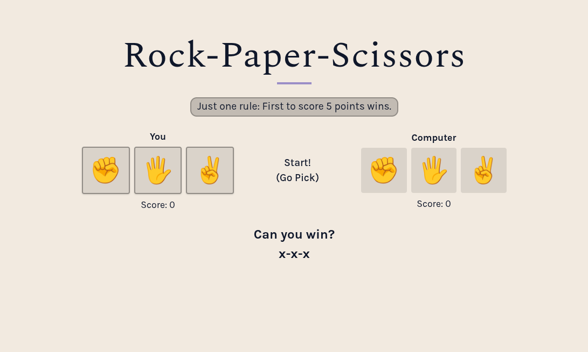
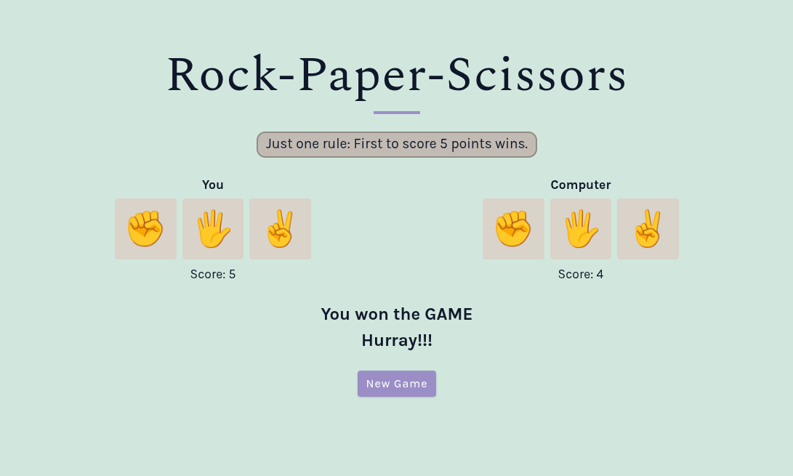

# Rock Paper Scissors

A game of Rock-Paper-Scissors vs. a Computer

## 🚀 Live Demo

[Link to live demo.](https://thepaladindev.github.io/rock-paper-scissors/)

## 📸 Preview

|                                 Hero View                                 |                                      Game Win                                       |
| :-----------------------------------------------------------------------: | :---------------------------------------------------------------------------------: |
|  |  |

## 🛠 Tech Stack

- HTML
- CSS
- JS
- git

## 💻 Getting Started

To view this project locally:

1. Clone the repository.
   ```bash
   git clone git@github.com:ThePaladinDev/rock-paper-scissors.git
   ```
2. Navigate into the directory.
   ```bash
   cd rock-paper-scissors
   ```
3. Start a local HTTP server:<br>
   - VS Code: Use the [Live Server](https://marketplace.visualstudio.com/items?itemName=ritwickdey.LiveServer) extension.
   - Node.js: Run `npx serve .` (Default port: 3000).
   - Python: Run `python -m http.server` (Default port: 8000)

4. Open your browser and navigate to the URL provided in your terminal (e.g., `http://localhost:PORT/`).

5. Stop the server by pressing `Ctrl+C` in the terminal once you're done testing the project.

## ✨ Features

- **Dynamic Layout:** A clean, responsive page that updates to reflect the game state.
- **Responsive Design:** Designed to work across various screen sizes.

## 🧠 What I learned

- **UX Design:**
  - Upon a game's conclusion, the player buttons become disabled. This is indicated visually by getting rid of the borders, the button no longer scaling, and a visual change in cursor.
  - A 'Reset Game' button appears on the screen at all times except when the game has not yet begun. Furthermore, if a game's winner is decided, the text changes to 'New Game'.
  - The page background changes to indicate the win/loss of a game.
- **Flexbox:**
  - Used the 'Flex' layout extensively across the project.
  - Used `flex-wrap` to achieve a responsive layout **without using media queries**.
- **CSS Architecture:**
  - Used CSS reset, variables, and a combination of shades and tints of colors to make a color palette for the page.
- **JavaScript:**
  - Made clean, modular functions such that if they don't need to know about the DOM, they don't.
  - Made functions to cleanup the entire app, like resetting scores, classes, and buttons in one go.
  - Adding and removing classes to do things like change the background of the app in response to game win/loss, hiding the reset game button when game is yet to start, etc.,
  - Used **Event Delegation**. A single event listener on the parent container to listen and respond to all the 'click' events on player buttons.

## 🏁 Conclusion

I have learned a lot about the DOM while working on this project. Especially happy with having used "Event Delegation", making classes in CSS just to be used in JS, etc.,

## 📜 License

This project is licensed under the MIT License - see the [LICENSE](./LICENSE) file for details.
